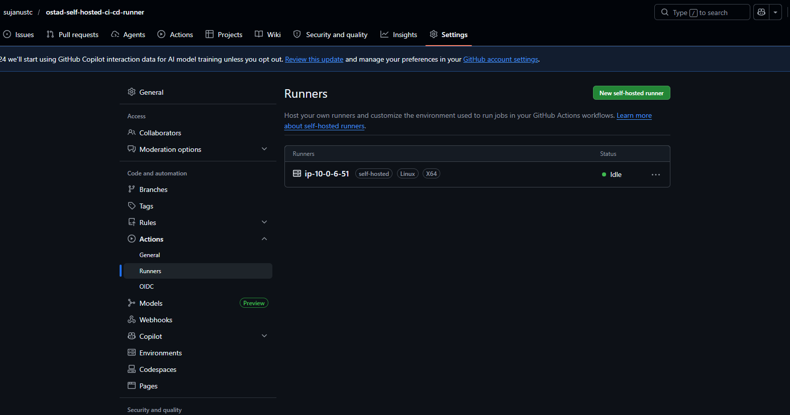
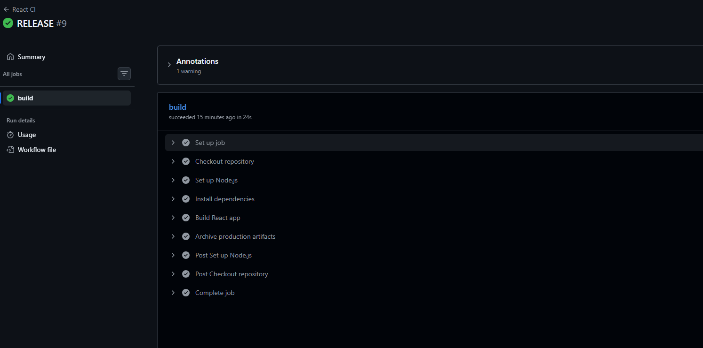
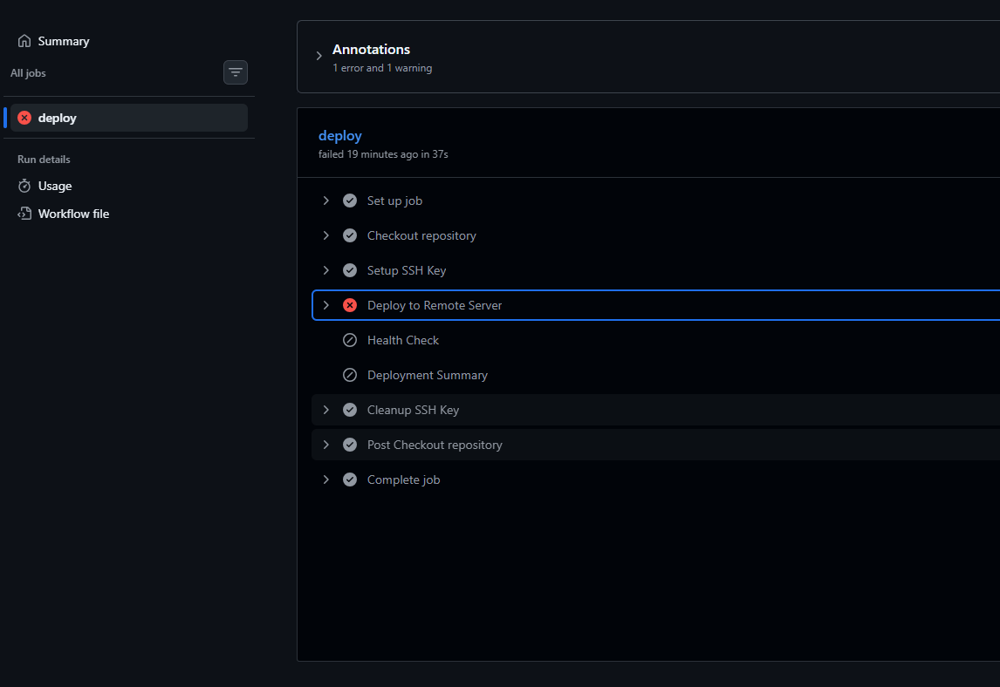
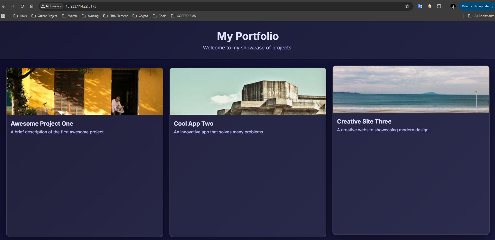

# Ostad React CI/CD Pipeline Project

This repository demonstrates a complete **Automated CI/CD Pipeline** for a React application using **GitHub Actions** and a **Self‑hosted Runner**.

---

## 🔗 Project Links
- **GitHub Repository**: [https://github.com/sujanustc/ostad-self-hosted-ci-cd-runner](https://github.com/sujanustc/ostad-self-hosted-ci-cd-runner)
- **CI Workflow**: [.github/workflows/ci.yml](.github/workflows/ci.yml)
- **Release Workflow**: [.github/workflows/release.yml](.github/workflows/release.yml)

---

## 📚 Concepts

### What is CI/CD?
- **CI (Continuous Integration)**: The practice of automatically building and testing code every time a team member pushes changes to the version control system. It ensures that new code integrates cleanly with the existing codebase.
- **CD (Continuous Deployment/Delivery)**: The automated process of delivering or deploying the application to production or staging environments after passing all tests.

### What is a Self-hosted Runner?
A self-hosted runner is a machine that you manage and maintain to run jobs from GitHub Actions. Unlike GitHub-hosted runners, self-hosted runners give you more control over the hardware, operating system, and software tools, allowing for faster builds and access to local network resources.

The screenshot below shows self hosted runner added to the github.


### Workflow Execution Process
1. **Trigger**: A push event occurs on the `development` branch.
2. **Checkout**: The runner clones the repository to access the source code.
3. **Environment Setup**: The runner ensures Node.js, npm, and other prerequisites (like Nginx) are installed.
4. **Build & Test**: The application runs `npm install` and `npm run build`.
5. **Deployment**: The production artifacts (`dist/` folder) are moved to the web server directory (e.g., `/var/www/html`), and Nginx is reloaded to serve the new version.

---

## ✅ Pipeline Verification

### 1. Successful Pipeline Execution
The screenshot below shows the GitHub Actions dashboard where the pipeline successfully completed all steps (Build, Test, and Deploy).



### 2. Failed Pipeline Debugging
The screenshot below shows a failed execution (e.g., due to a missing dependency or syntax error) and the debugging process in the logs.



### 3. Application Running in Browser
The screenshot below confirms that the application is successfully deployed and accessible via the browser.



## 🛠️ Local Development & Deployment

### Setup
```bash
npm install
npm run dev
```

### Triggering a Release
To trigger the automated deployment to the production server, include the keyword `RELEASE` in your commit message:
```bash
git commit -m "feat: updated portfolio RELEASE"
git push origin development
```

---
*Submitted as part of the Ostad CI/CD Assignment.*
